# Herio Green | VinFast

**URL:** [https://vinfastauto.com/vn_vi/herio-green](https://vinfastauto.com/vn_vi/herio-green)  
**Thời gian cào:** `2026-09-17T10:59:42.002535`  
**Tổng số ảnh Body bắt qua Network Tab:** `21`

## ⚡ Thông số nổi bật (Key Highlights)

| Thông số | Giá trị | Đơn vị |
| :--- | :--- | :--- |
| **Công suất tối đa** | `100` | kW |
| **Khoảng sáng gầm** | `160` | mm |
| **Quãng đường chạy (NEDC)** | `326` | km/lần sạc đầy |
| **Thời gian sạc** | `33` | phút |

## 📋 Bảng thông số kỹ thuật chi tiết

| Hạng mục | Giá trị | Phân loại |
| :--- | :--- | :--- |
| **Dài x rộng x Cao (mm)** | 3967 x 1723 x 1579 | Kỹ thuật |
| **Chiều dài cơ sở** | 2514 mm | Kỹ thuật |
| **Khoảng sáng gầm xe** | 160 mm | Kỹ thuật |
| **Công suất tối đa** | 100 kW | Kỹ thuật |
| **Mô men xoắn cực đại** | 135 Nm | Kỹ thuật |
| **Quãng đường chạy (NEDC)** | 326 km/lần sạc đầy | Kỹ thuật |
| **Dung lượng pin khả dụng** | 37,23 kWh | Kỹ thuật |
| **Bộ sạc tại nhà (kW)** | Tùy chọn | Kỹ thuật |
| **Thời gian nạp pin** | 33 phút (10%-70%) | Kỹ thuật |
| **Dẫn động** | FWD/Cầu trước | Kỹ thuật |
| **Chế độ lái** | Eco/Sport | Kỹ thuật |
| **Hệ thống treo (trước/sau)** | MacPherson/Dầm xoắn | Kỹ thuật |
| **Hệ thống phanh (trước/sau)** | Đĩa/Đĩa | Kỹ thuật |
| **Kích thước la-zăng** | 16 inch | Kỹ thuật |
| **Đèn chiếu sáng phía trước** | Bi-halogen, projector | Kỹ thuật |
| **Đóng/mở cốp sau** | Chỉnh cơ | Kỹ thuật |
| **Hệ thống điều hòa** | Chỉnh cơ | Kỹ thuật |
| **Màn hình giải trí cảm ứng** | 10 inch | Kỹ thuật |
| **Hệ thống loa** | 2 loa | Kỹ thuật |
| **Ghế lái** | Chỉnh cơ 4 hướng | Kỹ thuật |

## 🚀 Chi tiết các Section & Tính năng (Body)

### Section 1

**Hình ảnh liên quan:**

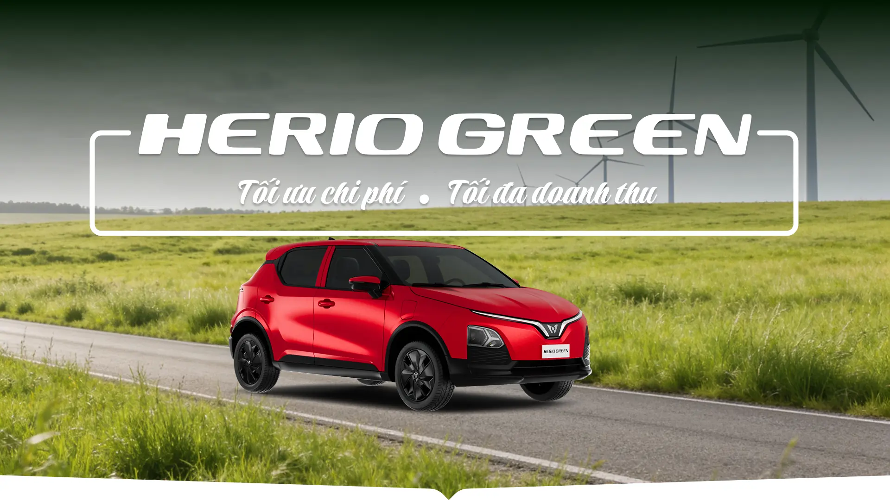

---

### Định nghĩa lại trải nghiệm xe dịch vụ thời đại xanh.Herio Green sở hữu thiết kế ...

Herio Green sở hữu thiết kế hiện đại, trẻ trung, cá tính và nổi bật với các lựa chọn phối màu nội ngoại thất, đảm bảo cá nhân hóa theo phong cách sống, cá tính và sở thích của mỗi khách hàng.

**Hình ảnh liên quan:**

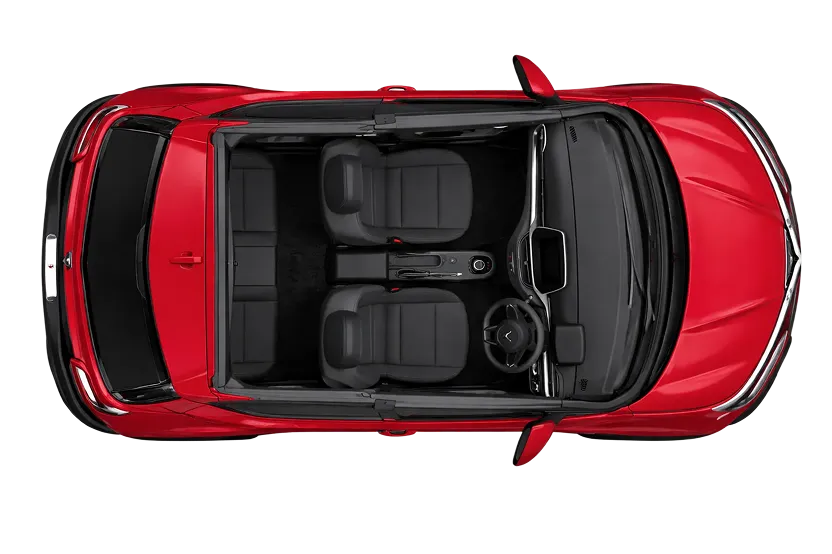

---

### Mọi tính năng, mọi hành trình,trọn vẹn trải nghiệm cùng Herio

**Hình ảnh liên quan:**

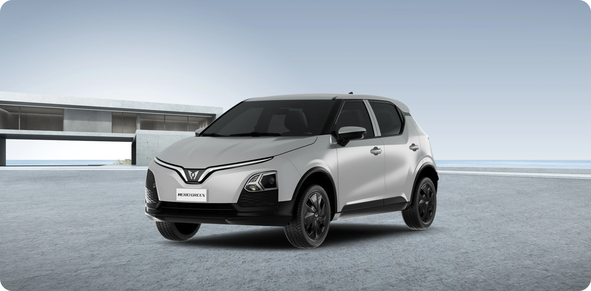

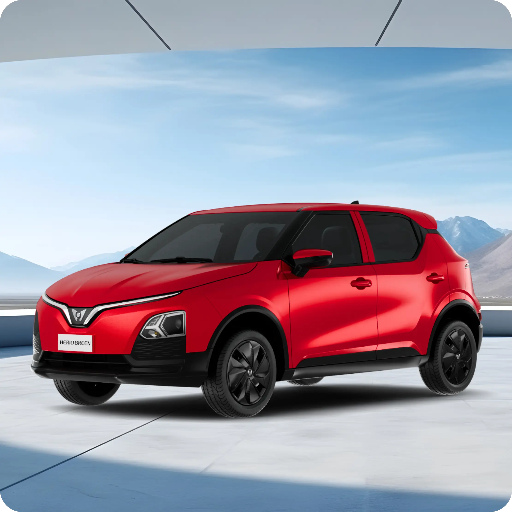

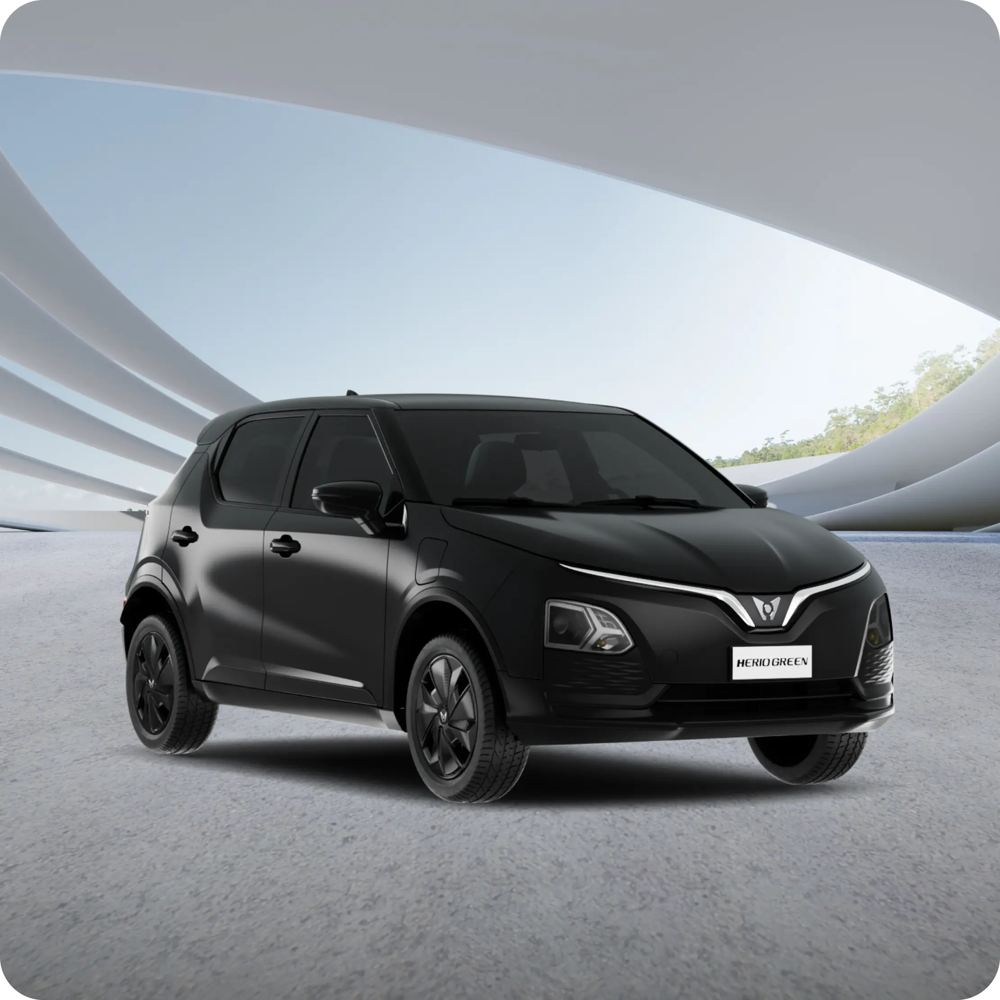

---

### Jet Black

**Hình ảnh liên quan:**

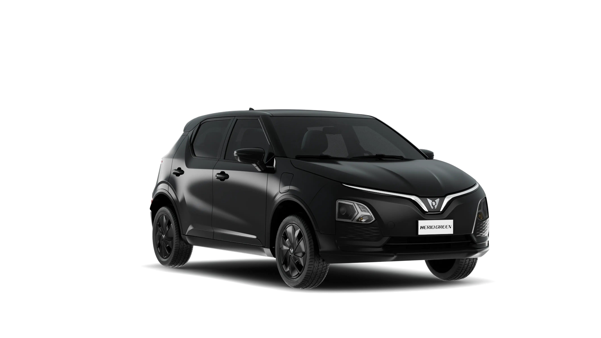

---

### Công nghệ ôm trọn cảm xúc người dùng

Mỗi hành trình, mỗi cảm xúc đều được chăm sóc.

**Hình ảnh liên quan:**

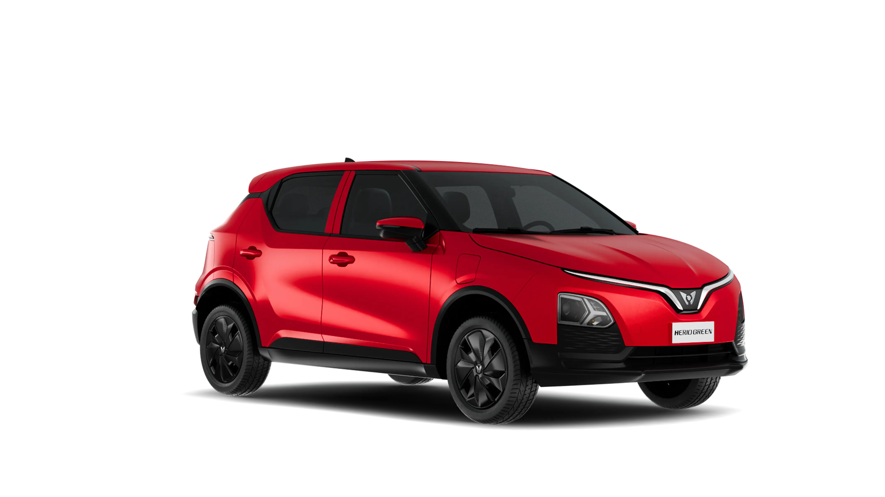

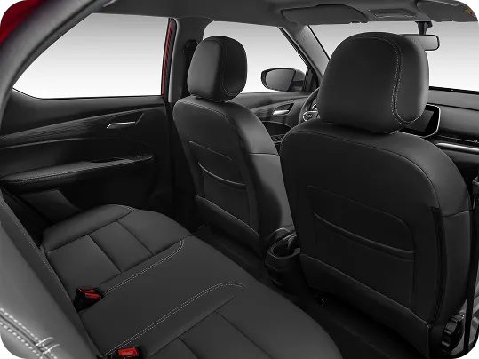

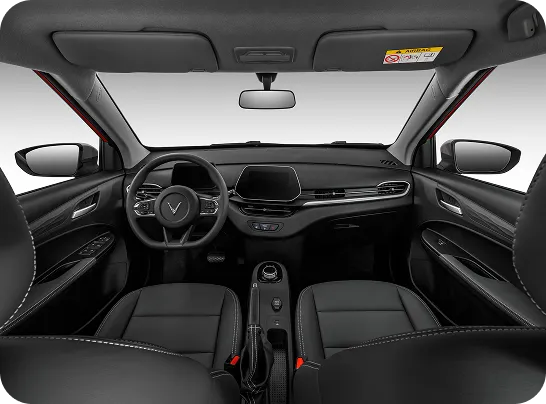

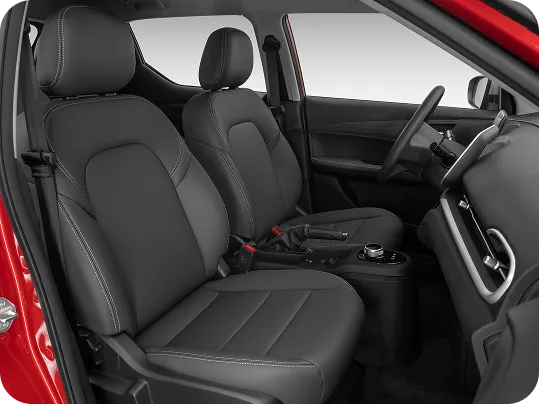

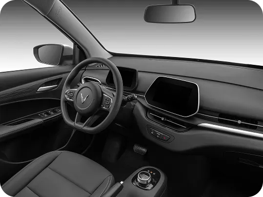

---

### Thông số tạo nên khác biệt

---

### So sánh giữa xe VinFast Herio Green và xe động cơ đốt trong

- Giá Xăng E10 RON 95-III Vùng I cập nhật gần nhất ngày 10/09/2026: 24.230 VNĐ/lít
- Giá Dầu diesel 0,001S-V Vùng 1 cập nhật gần nhất ngày 10/09/2026: 30.280 VNĐ/lít

**Hình ảnh liên quan:**

---

### Section 8

**Hình ảnh liên quan:**

---

## 🖼️ Bộ sưu tập hình ảnh Body (Network Captured Gallery)

Toàn bộ `21` hình ảnh Body được lưu trong thư mục `images/`:

| STT | Tên file | Kích thước | Dung lượng | URL gốc |
| :--- | :--- | :--- | :--- | :--- |
| 1 | [001_herio-green-section-2-car.webp](images/001_herio-green-section-2-car.webp) | 832x554 | 37.1 KB | [Link gốc](https://vinfastauto.com/themes/porto/img/pdp-page/herio-green/herio-green-section-2-car.webp) |
| 2 | [002_color-black.webp](images/002_color-black.webp) | 40x40 | 1.2 KB | [Link gốc](https://vinfastauto.com/themes/porto/img/pdp-page/herio-green/color-black.webp) |
| 3 | [003_color-silver.webp](images/003_color-silver.webp) | 40x40 | 1.0 KB | [Link gốc](https://vinfastauto.com/themes/porto/img/pdp-page/herio-green/color-silver.webp) |
| 4 | [004_color-red.webp](images/004_color-red.webp) | 40x40 | 1.3 KB | [Link gốc](https://vinfastauto.com/themes/porto/img/pdp-page/herio-green/color-red.webp) |
| 5 | [005_herio-green-section2-logo.webp](images/005_herio-green-section2-logo.webp) | 1517x104 | 11.4 KB | [Link gốc](https://vinfastauto.com/themes/porto/img/pdp-page/herio-green/herio-green-section2-logo.webp) |
| 6 | [006_parallax-2.webp](images/006_parallax-2.webp) | 546x404 | 23.1 KB | [Link gốc](https://vinfastauto.com/themes/porto/img/pdp-page/herio-green/parallax-2.webp) |
| 7 | [007_herio-green-logo-section-4.webp](images/007_herio-green-logo-section-4.webp) | 1920x828 | 24.2 KB | [Link gốc](https://vinfastauto.com/themes/porto/img/pdp-page/herio-green/herio-green-logo-section-4.webp) |
| 8 | [008_herio-green-section-2-background.webp](images/008_herio-green-section-2-background.webp) | 2880x506 | 24.4 KB | [Link gốc](https://vinfastauto.com/themes/porto/img/pdp-page/herio-green/herio-green-section-2-background.webp) |
| 9 | [009_parallax-3.webp](images/009_parallax-3.webp) | 539x404 | 21.7 KB | [Link gốc](https://vinfastauto.com/themes/porto/img/pdp-page/herio-green/parallax-3.webp) |
| 10 | [010_parallax-4.webp](images/010_parallax-4.webp) | 539x404 | 18.8 KB | [Link gốc](https://vinfastauto.com/themes/porto/img/pdp-page/herio-green/parallax-4.webp) |
| 11 | [011_parallax-1.webp](images/011_parallax-1.webp) | 539x404 | 18.2 KB | [Link gốc](https://vinfastauto.com/themes/porto/img/pdp-page/herio-green/parallax-1.webp) |
| 12 | [012_herio-green-section-5-background.webp](images/012_herio-green-section-5-background.webp) | 1920x1344 | 79.1 KB | [Link gốc](https://vinfastauto.com/themes/porto/img/pdp-page/herio-green/herio-green-section-5-background.webp) |
| 13 | [013_Banner-new.webp](images/013_Banner-new.webp) | 1920x1036 | 83.7 KB | [Link gốc](https://vinfastauto.com/themes/porto/img/pdp-page/herio-green/Banner-new.webp) |
| 14 | [014_herio-green-section-3-2.webp](images/014_herio-green-section-3-2.webp) | 2220x2220 | 86.4 KB | [Link gốc](https://vinfastauto.com/themes/porto/img/pdp-page/herio-green/herio-green-section-3-2.webp) |
| 15 | [015_Hero-new.webp](images/015_Hero-new.webp) | 1920x1080 | 111.0 KB | [Link gốc](https://vinfastauto.com/themes/porto/img/pdp-page/herio-green/Hero-new.webp) |
| 16 | [016_herio-green-section-3-background.webp](images/016_herio-green-section-3-background.webp) | 3372x2345 | 99.9 KB | [Link gốc](https://vinfastauto.com/themes/porto/img/pdp-page/herio-green/herio-green-section-3-background.webp) |
| 17 | [017_herio-green-section-3-3.webp](images/017_herio-green-section-3-3.webp) | 2220x2220 | 113.2 KB | [Link gốc](https://vinfastauto.com/themes/porto/img/pdp-page/herio-green/herio-green-section-3-3.webp) |
| 18 | [018_herio-black.webp](images/018_herio-black.webp) | 4268x2400 | 187.3 KB | [Link gốc](https://vinfastauto.com/themes/porto/img/pdp-page/herio-green/color/herio-black.webp) |
| 19 | [019_Minio.webp](images/019_Minio.webp) | 4268x2400 | 215.4 KB | [Link gốc](https://vinfastauto.com/themes/porto/img/pdp-page/herio-green/Minio.webp) |
| 20 | [020_herio-green-section-3-1.webp](images/020_herio-green-section-3-1.webp) | 4560x2250 | 280.4 KB | [Link gốc](https://vinfastauto.com/themes/porto/img/pdp-page/herio-green/herio-green-section-3-1.webp) |
| 21 | [021_11443-1787051531-herio-fuel-cost.png](images/021_11443-1787051531-herio-fuel-cost.png) | 230x128 | 9.0 KB | [Link gốc](https://static-cms-prod.vinfastauto.com/fuel_cost_comparison/11443-1787051531-herio-fuel-cost.png) |

