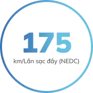
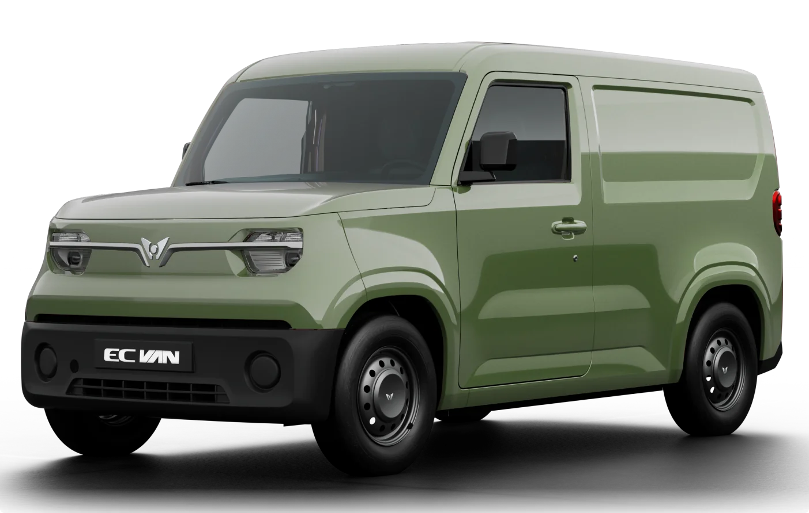
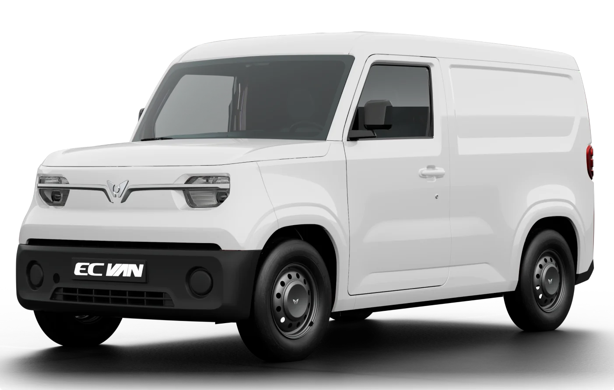
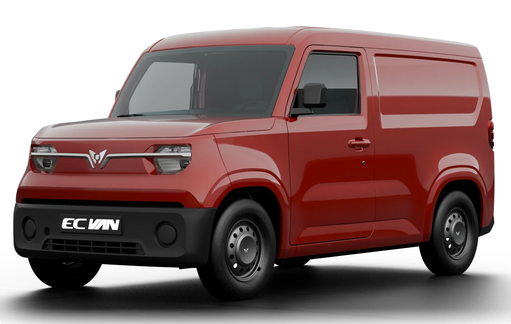
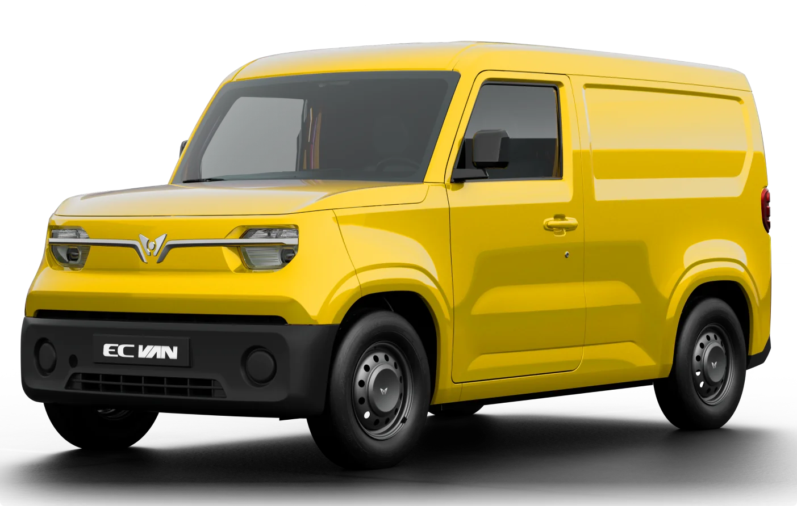
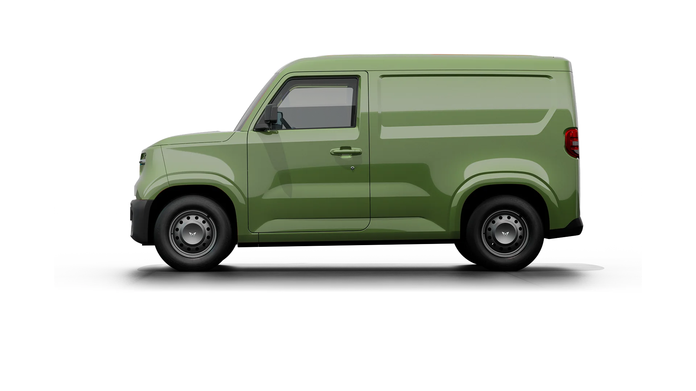
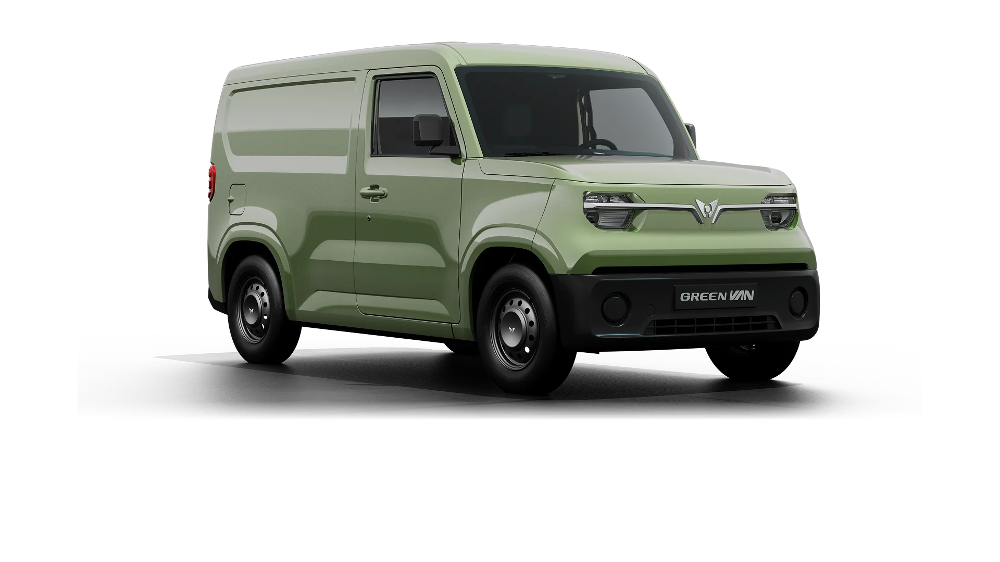
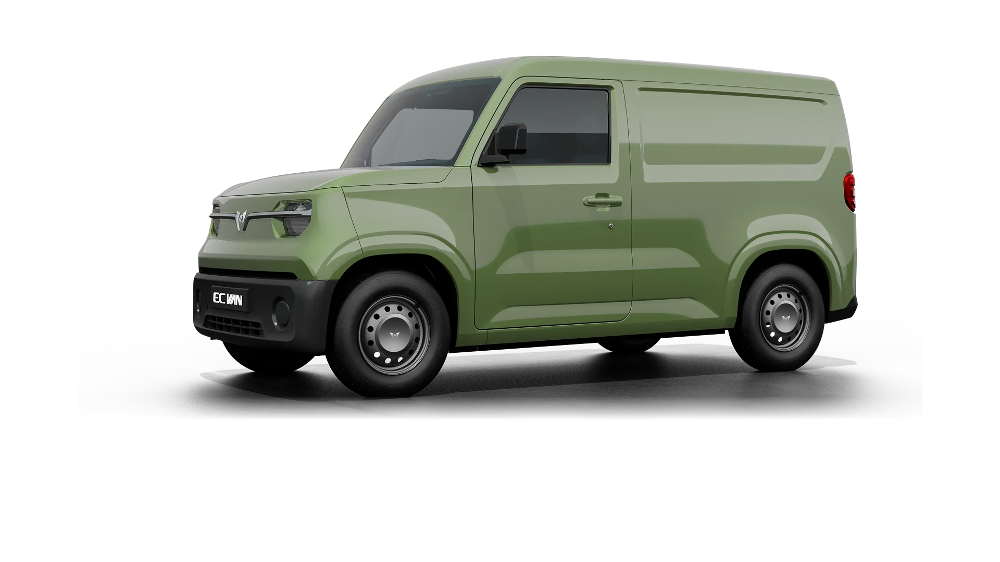
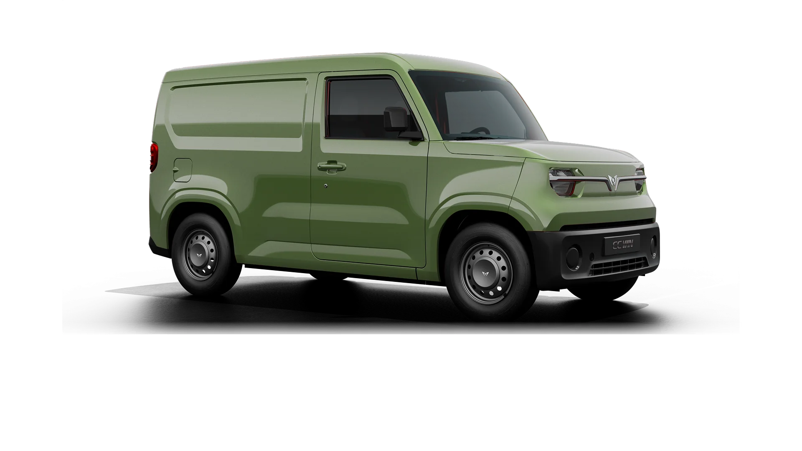

# EC Van | VinFast

**URL:** [https://shop.vinfastauto.com/vn_vi/vinfast-ecvan.html](https://shop.vinfastauto.com/vn_vi/vinfast-ecvan.html)  
**Thời gian cào:** `2026-09-17T11:39:50.694725`  
**Tổng số ảnh Body bắt qua Network Tab:** `11`

> Vinfast

## 📋 Bảng thông số kỹ thuật chi tiết

| Hạng mục | Giá trị | Phân loại |
| :--- | :--- | :--- |
| **Dài x rộng x Cao (mm)** | 3.767 x 1.680 x 1.790 | Kỹ thuật |
| **Chiều dài cơ sở** | 2.520 mm | Kỹ thuật |
| **Khoảng sáng gầm xe không tải** | 165 mm | Kỹ thuật |
| **Bán kính quay vòng** | 5,1 m | Kỹ thuật |
| **Dung tích khoang hành lý** | 2,6 m 3 | Kỹ thuật |
| **Số chỗ ngồi** | 02 chỗ | Kỹ thuật |
| **Công suất tối đa** | 30 kW | Kỹ thuật |
| **Mô men xoắn cực đại** | 110 Nm | Kỹ thuật |
| **Quãng đường di chuyển (NEDC)** | 175 km/sạc đầy | Kỹ thuật |
| **Dung lượng pin khả dụng** | 18,3 kWh | Kỹ thuật |
| **Công suất sạc nhanh DC tối đa** | 24,2 kW | Kỹ thuật |
| **Thời gian nạp pin nhanh nhất** | 42 phút (10% - 70%) | Kỹ thuật |

## 🚀 Chi tiết các Section & Tính năng (Body)

### Section 1

**Hình ảnh liên quan:**

---

### Vận tải đa năng, tiện dụng, sinh lời

Linh hoạt lưu thông nội đô, vận hành êm ái, giảm chi phí vận hành, tối đa lợi nhuận

- 2.520 mmChiều dài cơ sở
- 2,6 m3Dung tích khoang hành lý
- 110 NmMô-men xoắn cực đại
- 42 phút (10% - 70%)Thời gian nạp pin nhanh nhất

**Hình ảnh liên quan:**

---

### Cách mạng xanh trong vận tải hàng hóaEC Van tiên phong mang đến giải pháp vận ch...

EC Van tiên phong mang đến giải pháp vận chuyển thương mại đột phá, nổi bật với khả năng vận hành linh hoạt, êm ái và tiết kiệm chi phí. Sở hữu thiết kế hiện đại, tiện dụng cùng bảng màu ngoại thất với 4 lựa chọn nổi bật Xanh – Vàng – Trắng – Đỏ, EC Van không chỉ là phương tiện di chuyển mà còn là đối tác tin cậy, phương tiện sinh kế phù hợp cho kinh tế hộ gia đình, doanh nghiệp.

**Hình ảnh liên quan:**

---

### Section 4

EC Van có thiết kế nhỏ gọn phù hợp với mọi không gian và điều kiện đường sá từ thành thị đến nông thôn. Xe có thiết kế khoang lái 2 chỗ ngồi cùng khoang hành lý phía sau với dung tích chứa hàng lên tới 2.600L, tải trọng 650 kg, tối đa hóa năng suất vận chuyển trong từng chuyến đi.

**Hình ảnh liên quan:**

---

### Thông số kỹ thuật

(*)Lưu ý:

- Hình ảnh xe phiên bản tiền thương mại. Phiên bản thương mại có thể có một số điểm khác biệt.
- Các thông tin sản phẩm có thể thay đổi mà không cần báo trước.
- Quãng đường di chuyển được tính toán dựa trên kết quả kiểm định theo quy chuẩn toàn cầu (NEDC). Quãng đường di chuyển thực tế có thể thay đổi so với kết quả kiểm định, phụ thuộc vào tốc độ lái xe, nhiệt độ, địa hình, thói quen sử dụng của người lái, chế độ lái được cài đặt, số lượng hành khách, tải trọng hàng hóa, và các điều kiện giao thông khác.

---

### So sánh giữa xe VinFast EC Van và xe động cơ đốt trong

Vui lòng nhập thông tin xe động cơ đốt trong cần so sánh:

- Giá xăng E10 RON 95-III cập nhật gần nhất ngày 11/06/2026: 22.060 VNĐ/lít
- Giá dầu Diesel 0,001S-V cập nhật gần nhất ngày 11/06/2026: 27.130 VNĐ/lít

**Hình ảnh liên quan:**

---

### Section 7

**Hình ảnh liên quan:**

---

### Đăng ký tư vấn

---

## 🖼️ Bộ sưu tập hình ảnh Body (Network Captured Gallery)

Toàn bộ `11` hình ảnh Body được lưu trong thư mục `images/`:

| STT | Tên file | Kích thước | Dung lượng | URL gốc |
| :--- | :--- | :--- | :--- | :--- |
| 1 | [001_spec.webp](images/001_spec.webp) | 184x184 | 5.4 KB | [Link gốc](https://shop.vinfastauto.com/on/demandware.static/-/Sites-app_vinfast_vn-Library/default/dw635980fb/landingpage/ecvan/spec.webp) |
| 2 | [002_banner.webp](images/002_banner.webp) | 3840x2000 | 566.8 KB | [Link gốc](https://shop.vinfastauto.com/on/demandware.static/-/Sites-app_vinfast_vn-Library/default/dw4a977007/landingpage/ecvan/banner.webp) |
| 3 | [003_ecvan-jade.webp](images/003_ecvan-jade.webp) | 1403x892 | 114.2 KB | [Link gốc](https://shop.vinfastauto.com/on/demandware.static/-/Sites-app_vinfast_vn-Library/default/dwebf42c7b/landingpage/ecvan/ecvan-jade.webp) |
| 4 | [004_ecvan-white.webp](images/004_ecvan-white.webp) | 1403x892 | 108.7 KB | [Link gốc](https://shop.vinfastauto.com/on/demandware.static/-/Sites-app_vinfast_vn-Library/default/dwab63881b/landingpage/ecvan/ecvan-white.webp) |
| 5 | [005_ecvan-red.webp](images/005_ecvan-red.webp) | 1403x892 | 119.8 KB | [Link gốc](https://shop.vinfastauto.com/on/demandware.static/-/Sites-app_vinfast_vn-Library/default/dw9c284dea/landingpage/ecvan/ecvan-red.webp) |
| 6 | [006_ecvan-yellow.webp](images/006_ecvan-yellow.webp) | 1403x892 | 125.8 KB | [Link gốc](https://shop.vinfastauto.com/on/demandware.static/-/Sites-app_vinfast_vn-Library/default/dw7898b277/landingpage/ecvan/ecvan-yellow.webp) |
| 7 | [007_ecvan-img-04.webp](images/007_ecvan-img-04.webp) | 1920x1080 | 118.7 KB | [Link gốc](https://shop.vinfastauto.com/on/demandware.static/-/Sites-app_vinfast_vn-Library/default/dwd1898213/landingpage/ecvan/ecvan-img-04.webp) |
| 8 | [008_ecvan-img-01.webp](images/008_ecvan-img-01.webp) | 1920x1080 | 157.5 KB | [Link gốc](https://shop.vinfastauto.com/on/demandware.static/-/Sites-app_vinfast_vn-Library/default/dw07d506f1/landingpage/ecvan/ecvan-img-01.webp) |
| 9 | [009_ecvan-img-02.webp](images/009_ecvan-img-02.webp) | 1920x1080 | 155.9 KB | [Link gốc](https://shop.vinfastauto.com/on/demandware.static/-/Sites-app_vinfast_vn-Library/default/dw42eb4e46/landingpage/ecvan/ecvan-img-02.webp) |
| 10 | [010_ecvan-img-03.webp](images/010_ecvan-img-03.webp) | 1920x1080 | 145.2 KB | [Link gốc](https://shop.vinfastauto.com/on/demandware.static/-/Sites-app_vinfast_vn-Library/default/dw6afcbe67/landingpage/ecvan/ecvan-img-03.webp) |
| 11 | [011_ecvan-banner-01.webp](images/011_ecvan-banner-01.webp) | 3840x2160 | 973.5 KB | [Link gốc](https://shop.vinfastauto.com/on/demandware.static/-/Sites-app_vinfast_vn-Library/default/dw32a6625c/landingpage/ecvan/ecvan-banner-01.webp) |

